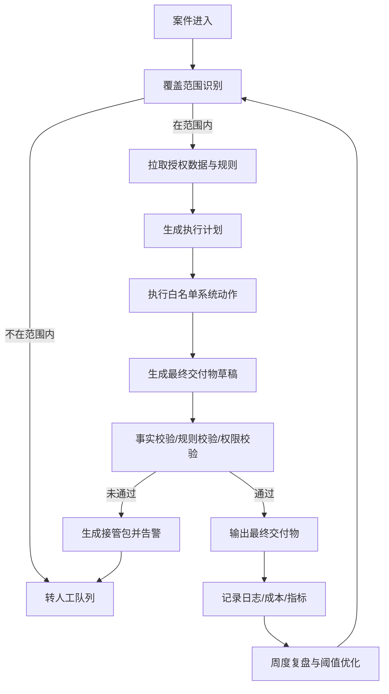

# 企业部署AI Agent技术战略与首个垂直Agent MVP顶层设计研究

## 执行摘要

企业要部署“像初级员工一样自主工作、无需人类审批、可直接交付最终成果”的 AI Agent，首要问题不是模型能力本身，而是**把自治权放进一个可验证、可审计、可回退、可承担责任的业务边界里**。从治理与监管视角看，可信 AI 的共同底座都强调有效性与可靠性、安全与韧性、透明与可解释、隐私保护、公平性、问责以及持续监测；而从当前 Agent 能力边界看，长链条、开放式、跨多系统高不确定任务仍明显不稳，这决定了企业的第一个 Agent 不应是“大而全的数字员工”，而应是**单一垂直领域、单线程案件闭环、规则可表达、输出可验收**的 Agent。 

因此，首个 MVP 最适合落在“案例闭环型垂直 Agent”上：围绕一种高频、规则相对稳定、数据可得、失败可回退的业务案件，自主完成信息收集、规则判断、系统操作、质量自检、最终文档生成与交付。实践和研究都表明，生成式 AI 在狭窄、重复、知识密集但可验收的工作中更容易产生可测量价值，例如客服与文书场景已经观察到明显生产率改进；大型企业成功案例也大多首先落在合同抽取、客服处理、工业工程辅助等任务上，而不是直接替代高影响审批决策。 

对企业而言，真正的战略要点不是“让 Agent 尽快拿到更多权力”，而是先建立**治理-场景-能力-验收-运营**五位一体的闭环：由高层明确风险偏好和责任归属；由业务域负责人定义任务边界与可接受失败；由法务、隐私、安全、审计共同确定监管触点；由运营团队持续监控质量、异常、成本、收益与组织影响。NIST、OECD、ISO/IEC 42001、欧盟 AI Act 以及中国现行生成式 AI、算法推荐、内容标识与个人信息保护规则，都在不同角度指向同一结论：**企业必须把 AI 当成一个受治理的业务系统，而不是一个会聊天的工具。** 

基于这些约束与机会，本文的核心建议是：企业的第一个无需审批型垂直 Agent，应优先布局为**低到中风险、案件闭环型、最终交付物导向**的 Agent，而不应首发于招聘、授信审批、医疗诊疗、员工监控、公共福利资格裁定等高影响场景。前者更容易形成 ROI 闭环，也更符合现阶段技术成熟度与监管现实；后者则更容易触发高风险 AI、人权影响评估、自动化决策救济、解释义务与更严格的人类监督要求。 

## 核心结论与适用前提

### 原则

企业部署首个垂直 Agent，最重要的普适原则不是“尽可能智能”，而是“**尽可能把任务设计成 AI 能稳定完成的形状**”。NIST 将可信 AI 概括为有效可靠、安全、韧性、透明、可解释、隐私增强、公平与问责；OECD 则进一步要求人类能进行适当监督、在 AI 产生不当行为或风险时能够覆盖、修复或安全下线。换言之，真正成熟的 Agent 不是“无限自治”，而是“在受约束的自治空间内稳定产出”。 

当前前沿 Agent 的能力提升很快，但“长时程任务不稳定”仍是公开研究中的共同结论。METR 以“任务时长”衡量 Agent 完成能力，给出的方向性信号是：到 2025 年末，一些前沿模型在软件类任务上的 50% 成功率时间跨度大约在 50 分钟量级；另有研究显示，超过 120 步的长链任务准确率会明显崩塌。把这一现实投射到企业场景，首个 MVP 就不应选择跨部门、多例外、多轮外部沟通、持续数天且高度依赖隐性经验的工作，而要优先选择**可在短周期内完成、可拆成有限步骤、关键结果可检查**的任务。这里的外推属于本文基于现有研究所作的策略推断。 

### 策略

从顶层设计上，企业应把首个 Agent 定位为“**垂直领域内的自治处理器**”，而不是“通用助理”。它应具备四个边界条件。第一，任务边界必须明确，能够回答“它处理什么”和“它绝不处理什么”。第二，决策边界必须明确，能够回答“它能自主决策到什么程度”。第三，输出边界必须明确，能够回答“它最终交付什么可直接使用的成果”。第四，回退边界必须明确，能够回答“什么时候自动停下并把案件与证据包交回人工”。这些边界的建立，与 NIST 在 MAP、MEASURE、MANAGE 中要求的任务定义、知识限制文档化、相近部署条件下的验证、生产中持续监控和回退机制是一致的。 

据此，企业第一个 Agent 的理想任务形态，通常具备以下特征：高频、规则稳定、数据已数字化、结果可格式化、错误后果可控、可设置金额阈值或权限阈值、可自动形成“最终交付物”。与此相对，凡是直接决定个人工作关系、信用、教育机会、医疗诊疗、社会福利资格的任务，都应被视为首发禁区或至少非首发优先级，因为欧盟 AI Act 已将其中大量场景列为高风险；GDPR 针对仅基于自动化处理且对个人产生法律或类似重大影响的决策设有限制；中国个人信息保护法也强调自动化决策的透明、公平与相关拒绝/说明权利。 

### 具体可衡量指标与验收标准

对于首个 Agent，最关键的不是模型 benchmark，而是业务验收指标。建议把验收指标分为四层：业务层、质量层、风险层、运营层。业务层看周期缩短、人工工时替代、吞吐量提升；质量层看一次通过率、必填字段完整率、事实错误率、政策违例率；风险层看越权率、隐私事件数、不可解释输出占比、异常回退成功率；运营层看 P95 响应时长、案件成功闭环率、故障恢复时间、单位案件成本。NIST 明确要求性能或保证标准应在接近真实部署条件下做定量或定性测量并形成文档，且生产中的行为需要持续监控。表中的具体阈值建议值属于本文综合建议，未指定来源。 

### 示例场景

以下三个“首发友好”示例场景，均为本文策略示例，未指定来源，但它们共同符合“案件闭环、规则明确、输出可验收”的要求：

| 跨行业垂直 Agent 示例 | 典型行业 | 任务描述 | 最终交付物 |
|---|---|---|---|
| 供应商质量异常闭环代理 | 制造、零售供应链、医疗器械 | 自主收集质检/批次/合同/SOP 信息，判定处理路径，生成整改通知、8D/CAPA 报告和后续跟踪计划 | 可直接下发的整改包与结案报告 |
| 低额退款争议结案代理 | 零售、电商、旅游、本地生活 | 在额度和政策阈值内自主核验订单、证据、客服记录与退款规则，完成退款/补偿方案并生成客户通知 | 可直接发送给客户的结案通知与系统更新 |
| 标准故障工单闭环代理 | 设备服务、电信、SaaS、工业运维 | 聚合日志、工单历史、知识库和 SLA，自主诊断标准故障、执行既定修复动作并输出结案摘要 | 可直接交付给客户或管理者的工单结案包 |

## 治理与组织设计

### 原则

治理不是上线前的审批动作，而是 Agent 生命周期的经营系统。NIST 的 GOVERN 功能要求组织建立透明的政策、流程、角色、责任、持续复盘、AI 系统清单、退役机制以及第三方风险应对；并强调高层要对 AI 部署和风险决策负责。ISO/IEC 42001 进一步把这一要求上升为 AI 管理体系，要求组织建立、实施、维护并持续改进其 AI 管理系统。对企业而言，这意味着首个 Agent 不能由单一技术团队“拍脑袋上线”，而必须由业务、法务、隐私、安全、审计、运维共同构成治理结构。 

NIST 还将“构建和使用模型的人”与“验证和确认模型的人”分离视为最佳实践，这与企业常说的“三道防线”高度一致。对首个 Agent 来说，这意味着：业务域 Owner 负责业务结果，产品/工程团队负责构建和运营，独立的风险/审计/控制团队负责验证与复核，不可由同一团队同时拥有目标、执行和裁决三种权力。 

### 策略

建议企业建立“**一个委员会 + 一条产品线 + 一套控制面**”的组织模式。委员会层面，由高层牵头的 AI 治理委员会定义风险偏好、场景准入规则、例外审批机制和重大事件升级路径。产品线层面，每个垂直 Agent 必须有明确的业务 Owner 和 Agent 产品 Owner，前者对结果负责，后者对能力范围、验收和运营负责。控制面层面，要统一管理模型供应商准入、权限与身份、日志、评测、内容标识、监控与应急响应。NIST 的 GenAI Profile 特别强调对第三方模型、API、开源工具、嵌入式组件做持续监控和应急预案。 

如果企业涉及欧盟业务，还应把 AI literacy 纳入治理要求。欧盟 AI Act 第 4 条已要求 AI 系统提供者和部署者采取措施，确保相关员工和代运营人员具备足够 AI 素养；这意味着流程设计、培训、值班、异常判断与人工接管能力都必须被制度化。 

### 具体可衡量指标与验收标准

下面的角色设计是建议性组织蓝图，职责拆分依据 NIST、ISO/IEC 42001、欧盟 AI Act 与中国监管要求综合整理；具体编制人数和预算未指定来源。

| 角色 | 核心职责 | 关键决策权 | 核心验收口径 |
|---|---|---|---|
| 执行 Sponsor | 设定业务目标、风险偏好、资源保障 | 场景立项 / 停止 | 是否符合公司级 ROI 与风险容忍度 |
| 业务域 Owner | 定义任务边界、政策、质量标准 | 覆盖范围 / SLA / 权限阈值 | 一次通过率、例外率、业务 KPI |
| Agent 产品 Owner | 负责需求、路线图、上线策略、运营 | MVP 范围 / 版本门槛 | 覆盖率、成功闭环率、用户采用率 |
| 数据 Owner | 定义数据源、口径、更新频率、保留期 | 数据准入 / 共享方式 | 来源合法、口径一致、版本可追溯 |
| 隐私与法务 | 识别自动化决策、个人信息、知识产权与监管触点 | 高风险限制 / 合同条款 | 零重大合规事件 |
| 安全与 IAM | 身份、权限、密钥、隔离、审计 | 最小权限 / 访问策略 | 越权率为零、敏感访问可追踪 |
| 模型风险 / AI 治理 | 评测、风险登记、第三方尽调、红队 | Go/No-Go 建议 | 评测完成率、缺陷关闭率 |
| Agent Ops / 运行团队 | 监控、告警、回退、事件响应 | 版本切换 / 回滚 | P95 时延、MTTR、异常回退成功率 |
| 内审 / 合规审计 | 定期抽样、复盘、证据保全 | 审计发现升级 | 审计缺陷整改闭环率 |

说明：上表为建议性职责划分，未指定来源；其治理原则参考 NIST AI RMF、NIST GenAI Profile、ISO/IEC 42001 与欧盟 AI Act。 

### 示例场景

将上述组织映射到示例场景时，制造业可由质量总监担任业务域 Owner，零售/电商可由售后负责人担任，设备服务可由服务运营总监担任；但三类场景的共性不变：业务域 Owner 对“质量”和“授权边界”负责，产品 Owner 对“能力与体验”负责，控制团队对“是否可上线”负责。示例映射为本文策略示例，未指定来源。

## 场景识别与首个 MVP 选择

### 原则

企业选择首个垂直 Agent 时，最容易犯的错误，是把“影响力最大”的任务误当成“首发最优”的任务。真正应该优先的，是**业务价值高、实现难度可控、数据可得、合规风险可控、能规模化复制、ROI 可被证明**的任务。NIST 的 MAP 功能强调，在决定是否推进 AI 系统开发或部署前，必须先理解目标收益、非金钱成本、系统知识边界、人类监督过程以及第三方数据和组件风险。 

### 策略

建议企业用“**价值-控制双轴**”来筛选场景。价值轴看吞吐量、时间成本、错误成本、收入影响、客户体验。控制轴看任务稳定性、规则清晰度、数据结构化程度、输出可验证性、失败可回退性、监管触点复杂度。凡是“高价值但低可控”的场景，不适合作为第一个 Agent；应该先用在更可控的子任务或“最终交付物生成”环节，而不是全程自治。这个判断，与当前生产率研究、公开企业案例和监管要求高度一致。 

### 候选场景优先级评估表

下表为建议性评分模型，评分标准为 1 到 5 分；其中“合规风险”分数越高表示风险越高。分值与推荐结论为本文综合建议，未指定来源。

| 候选场景 | 业务价值 | 实现难度 | 数据可得性 | 合规风险 | 可扩展性 | ROI 预估 | 结论 |
|---|---:|---:|---:|---:|---:|---:|---|
| 供应商质量异常闭环代理 | 5 | 3 | 4 | 2 | 4 | 5 | 强烈建议首发 |
| 低额退款争议结案代理 | 5 | 3 | 4 | 3 | 5 | 5 | 强烈建议首发 |
| 标准故障工单闭环代理 | 4 | 3 | 4 | 2 | 4 | 4 | 建议首发 |
| 应收账款催收与争议结清代理 | 4 | 4 | 3 | 3 | 4 | 4 | 可作为第二梯队 |
| 招聘筛选与录用决策代理 | 4 | 3 | 4 | 5 | 4 | 2 | 不建议作为首个 MVP |
| 授信审批 / 保单定价审批代理 | 5 | 5 | 4 | 5 | 4 | 2 | 不建议作为首个 MVP |

说明：不建议首发于招聘、授信、保单定价等场景，主要基于欧盟 AI Act 对就业、教育、信用、公共/私营关键服务中的高风险分类，以及 GDPR 和中国个人信息保护法对高影响自动化决策的限制与解释要求。 

### 首个垂直 Agent 的建议画像

如果必须给出一个跨行业可迁移的首个 MVP 答案，本文建议选择**单线程案件闭环型垂直 Agent**。它不是通用助理，而是某一类业务案件的自治处理器。下表为建议画像，除监管引用外，具体阈值为建议值，未指定来源。

| 关键属性/维度 | 建议定义 |
|---|---|
| 行业适用性 | 制造、零售、电商、设备服务、电信、B2B 服务等；共性是存在高频案件与标准化结案文档 |
| 任务类型 | 单线程案件处理、证据归集、规则判断、有限系统动作、最终文档生成 |
| 输入格式 | 表单、邮件、对话记录、PDF、合同条款、ERP/CRM/工单系统记录、知识库条目 |
| 输出格式 | 可直接发送或归档的结案通知、整改包、工单结案包、管理摘要、系统状态更新 |
| 决策权限边界 | 只在明确阈值内自治；不触及招聘录用、授信审批、诊疗裁定、公共福利资格等高影响决定 |
| 失败模式 | 数据缺失、政策冲突、工具失败、证据不足、越权请求、模型幻觉、外部依赖超时 |
| 回退策略 | 生成“证据包 + 已执行步骤 + 待人工判断点”并自动转人工队列 |
| 质量阈值 | 必填字段完整率 100%；政策违例率 0；关键事实错误率接近 0；一次通过率建议 ≥95% |
| SLA | 标准案件 P95 完成时长建议在分钟到小时级；异常案件转人工需实时或近实时 |
| 安全与合规要求 | 最小权限、敏感字段脱敏、日志留存、输出可追溯、第三方模型尽调、外发内容标识 |
| 监管触点 | 中国：PIPL、生成式 AI 办法、算法推荐规定、内容标识办法；欧盟：AI Act、GDPR；如涉及工作场所情绪识别等，还可能触碰禁止条款 |
| 数据来源与治理 | 只接入“记录系统”与已批准知识源；来源合法、版本可追溯、更新频率明确、保留期明确 |
| 监控指标 | 覆盖率、闭环率、一次通过率、越权率、异常率、回退率、P95 时延、单位案件成本 |
| KPI | 人工工时节省、周期缩短、错误成本减少、客户/内部满意度改善、收入或现金流改善 |
| 里程碑与时间表 | 建议依次经历发现、定型、影子运行、限定生产、扩容；具体见后文路线图 |
| 所需组织角色与职责 | 执行 Sponsor、业务域 Owner、Agent 产品 Owner、数据 Owner、隐私法务、安全 IAM、模型风险、Ops、内审 |

说明：关于高影响场景的限制依据欧盟 AI Act 和自动化决策规则；关于安全、日志、第三方风险和透明性要求，参考 NIST、OECD、中国生成式 AI 与算法推荐规则。 

## MVP 能力边界与验收体系

### 原则

首个 MVP 的目标不是覆盖最多功能，而是形成**最小可行能力集**：只具备完成闭环所必需的能力，且每一项能力都能被明确定义、测试和验收。NIST 要求在与部署环境相近的条件下验证性能、有效性、安全、隐私、可解释性和公平性；欧盟 AI Act 则要求高风险 AI 具备透明说明、日志记录、人类监督与技术文档能力。即使你的首个 Agent 不属于法定高风险，也应按这一思路建设，因为这是企业级可运营性的最低门槛。 

### 策略

建议把第一个 Agent 的能力分成“业务执行能力”和“控制能力”两组。业务执行能力负责把案件做完；控制能力负责确保它做完的过程可接受。一个常见误区，是先追求更复杂的规划、多 Agent 协作和更强操作性，而忽视证据链、权限隔离、版本管理、输出校验和故障回退。企业首发阶段应当反过来：**先把控制能力做厚，再让执行能力逐步放权。** 

### MVP 能力清单表

下表基于 NIST、欧盟 AI Act、中国相关规则综合整理；“必需/可选”与具体阈值为建议值，未指定来源。

| 能力项 | 必需/可选 | 验收标准 | 示例输入/输出 |
|---|---|---|---|
| 覆盖范围识别 | 必需 | 能识别案件是否在覆盖范围内；范围外召回率建议接近 100% | 输入：案件表单；输出：在/不在范围及原因 |
| 多源证据归集 | 必需 | 必拿字段完整率 100%；证据源有时间戳与来源标记 | 输入：ERP/CRM/PDF/邮件；输出：证据包 |
| 规则与政策应用 | 必需 | 同规则样本中的判断一致性高；政策违例率为 0 | 输入：政策库；输出：适用规则与裁决路径 |
| 任务计划与执行 | 必需 | 能按批准动作清单执行；越权动作率为 0 | 输入：案件目标；输出：执行步骤记录 |
| 系统动作能力 | 必需 | 仅能调用白名单工具；动作结果可回放 | 输入：退款/工单/通知指令；输出：系统回执 |
| 最终交付物生成 | 必需 | 文档结构符合模板；可直接发送/归档；人工二次加工需求最小化 | 输入：证据与规则；输出：结案通知/整改报告 |
| 自检与交叉校验 | 必需 | 关键事实、金额、日期、主体等字段自动二次核验 | 输入：草稿输出；输出：校验通过/失败 |
| 异常识别与回退 | 必需 | 任一高风险异常可自动停机并转人工；回退包完整 | 输入：异常信号；输出：人工接管包 |
| 审计日志与可追溯 | 必需 | 记录输入来源、规则版本、动作链、输出版本、操作者身份 | 输入：运行全过程；输出：审计记录 |
| 身份与权限隔离 | 必需 | 最小权限、密钥轮换、可按 Agent 身份追踪 | 输入：系统访问请求；输出：授权/拒绝 |
| 解释与摘要能力 | 可选但强烈建议 | 能生成“为何如此决定”的简明业务解释 | 输入：已决案件；输出：解释摘要 |
| 主动学习与阈值优化 | 可选 | 仅在受控反馈闭环内更新；禁止未审批自扩权 | 输入：复盘反馈；输出：阈值调整建议 |

说明：NIST 明确要求对性能、有效性、安全、解释性、隐私与生产中表现做文档化测量；欧盟 AI Act 要求日志、技术文档、说明与监督机制。表中具体验收阈值为本文建议值。 

### 端到端运行与治理闭环

下面的流程图反映的是**首个自治型垂直 Agent 的标准生产闭环**：先判断是否在可自治范围内，再执行案件处理；如果任何一步未达到质量或合规阈值，就进入回退或接管流程。这种“先范围、后执行、再校验”的结构，符合 NIST 对预部署测试、持续监控和事件处理的要求，也符合 OECD 对可覆盖、可修复、可下线机制的要求。 

### 示例场景

以制造业“供应商质量异常闭环代理”为例，最小能力集只需要：识别案件是否属于标准质量异常、拉取质检和批次证据、应用质量政策、生成整改通知和结案包、记录日志并在例外时转人工。它不需要一开始就具备开放式多 Agent 协作。零售“低额退款争议结案代理”和设备服务“标准故障工单闭环代理”同理：首发阶段追求的是**单案闭环稳定性**，而不是“什么都能干”。示例为本文策略示例，未指定来源。

## 风险、合规、数据与审计

### 原则

只要企业希望 Agent 能“完全自主决策”，风险管理就不能再停留在模型层，而必须延伸到**数据、权限、流程、输出、供应链、员工与客户影响**。NIST GenAI Profile把治理、内容来源、预部署测试和事件披露列为核心考量，并要求组织维护测试与验证历史、第三方尽调、持续监控和应急响应。OECD 进一步要求可追溯性，以便事后分析输出与响应责任。 

中国侧的监管重点是：数据来源合法、个人信息与知识产权合规、对外服务的内容治理与标识、算法备案/安全评估、投诉举报与日志留存。官方《生成式人工智能服务管理暂行办法》要求训练数据和基础模型来源合法，涉及知识产权不得侵权，涉及个人信息须取得同意或符合法律规定，并提高训练数据真实性、准确性、客观性与多样性；同时要求建立投诉举报机制，对具有舆论属性或社会动员能力的服务开展安全评估并履行算法备案。中国《人工智能安全治理框架》则强调风险导向、敏捷治理以及从模型算法安全、数据安全、系统安全到现实域、认知域、伦理域应用安全的全链路治理。 

面向欧盟市场时，企业还必须注意三类红线。第一，招聘、教育、信用、公共福利等高影响业务已被欧盟 AI Act 纳入高风险；第二，工作场所和教育机构中的情绪识别被列为禁止实践之一；第三，受到高风险 AI 输出影响并产生法律或类似重大影响的个人，享有获取清晰而有意义解释的权利。对于任何想在这些领域推出“无需人工审批”的 Agent 的企业来说，这几乎意味着首个 MVP 不应选在这些场景。 

### 策略

数据治理上，建议坚持“四本账”：**来源账、敏感度账、版本账、保留账**。来源账回答数据从哪里来、是否合法、是否有知识产权和个人信息处理依据；敏感度账回答哪些字段敏感、谁能看、谁能写；版本账回答规则、知识库、模板和模型何时更新；保留账回答日志、输入、输出和审计记录保留多久、何时清除。中国个人信息保护法要求处理个人信息具有明确、合理目的，与目的直接相关，并限于最小范围，且遵循公开透明原则；这意味着企业首个 Agent 不应“先把所有数据接进来再说”，而应从最小必要开始。 

可解释性与审计上，企业不必追求“把模型原理完整讲给用户听”，但必须至少做到三件事：一是说明该 Agent 正在做什么、能做什么、不能做什么；二是保留关键输入、规则版本、执行步骤、输出版本和异常记录；三是在重要决定或争议时，能向业务、法务、审计给出清晰的业务解释。NIST 明确指出，可解释系统更容易被调试、监控、文档化和审计；OECD 要求对数据来源、因素、过程和逻辑提供有意义的信息；欧盟 AI Act 也要求技术文档、日志和解释能力。 

यदि Agent 对外生成或传播内容，并落入中国相关范围，自 2025 年 9 月 1 日起施行的《人工智能生成合成内容标识办法》要求对生成合成内容进行显式和隐式标识；与之配套的国家标准 GB 45438-2025 也已明确“人工智能生成合成内容标识方法”。因此，任何外发客户通知、营销内容、公共网页答复、面向社会的自动生成文本，都不能只看业务体验，还要把标识、元数据和留痕纳入设计。 

### 风险矩阵表

下表为建议性风险矩阵，控制项主要综合 NIST、OECD、欧盟 AI Act 与中国规则而来；具体预警阈值和责任分配为建议值，未指定来源。

| 风险 | 典型触发 | 主要后果 | 核心控制 | 回退策略 |
|---|---|---|---|---|
| 幻觉或证据捏造 | 非结构化材料不足、模型自补全 | 错误结案、对外错误承诺 | 强制证据引用、必填字段核验、事实二次校验 | 自动中止并转人工 |
| 政策误用 | 规则冲突、知识库版本过旧 | 合规违例、赔付错误 | 规则版本管理、冲突检测、审批后的知识发布 | 锁定旧版本并人工复核 |
| 个人信息泄露 | 输入过量、日志暴露、外部模型不当使用 | 合规处罚、客户信任损失 | 最小必要、脱敏、密钥隔离、供应商尽调 | 断开外发、启动事件响应 |
| 权限滥用 | Agent 拥有过宽系统权限 | 非法修改记录、财务损失 | 最小权限、白名单动作、按 Agent 身份审计 | 立即冻结凭证并回滚 |
| 第三方模型或插件风险 | API 异常、插件失控、供应商中断 | 业务停摆、数据外泄 | 第三方评估、SLA、替代路径、应急预案 | 切换备用路径或人工接管 |
| 解释不足 | 只给结论不给依据 | 审计无法通过、纠纷升级 | 业务解释模板、自动生成理由摘要、日志保全 | 人工补充说明 |
| 输出不可追踪 | 无版本、无时间戳、无来源 | 无法复盘、无法问责 | 全链路日志、内容来源与元数据跟踪 | 停止自治，回归人工 |
| 不当外部承诺 | 对客规则解释错误 | 法律责任、赔偿 | 对外承诺模板、阈值限制、强校验 | 召回通知并人工修正 |
| 员工/客户权益风险 | 用于招聘、信用、员工监控等高影响环节 | 监管风险、声誉风险 | 场景红线清单、高风险禁入 | 根本不上线该场景 |

说明：第三方风险、日志、输入来源、内容溯源、事件披露、持续监控等控制要求参考 NIST GenAI Profile；权益影响与解释要求参考 OECD、欧盟 AI Act、GDPR 与中国个人信息保护法/算法推荐规定。 

## 部署运营、度量与路线图

### 原则

首个 Agent 的上线方式，应该是“**渐进式委派**”，而不是“一次性交权”。NIST 的 MANAGE 功能要求把后部署监控、上诉与覆盖、退役、事件响应、恢复和变更管理一起纳入；这恰好对应企业最实际的落地路径：先影子运行，再限定生产，再在稳定达标后扩大自治范围。 

### 策略

建议把部署路径分为三个委派层级。第一层是**影子层**：Agent 生成建议和最终包草稿，但不执行系统动作，也不对外发送。第二层是**限定自治层**：在金额、风险、客户等级、案例类别、时间窗等阈值内，Agent 可以自主执行并交付。第三层是**规则扩容层**：在保持控制面不变的前提下，增加覆盖场景、系统接口和自治权限。这里的关键不是技术栈变化，而是业务授权边界和风险阈值的逐步扩大。这个思路与 NIST 的持续监控、变化管理和第三方 contingency 要求一致。 

### 监控指标与 KPI 体系

下表为建议性指标体系，指标分类参考 NIST 对性能、有效性、安全、透明、隐私和持续监控的要求；具体验收阈值为建议值，未指定来源。

| 指标类别 | 核心指标 | 业务意义 | 建议预警方向 |
|---|---|---|---|
| 业务价值 | 工时节省、周期缩短、吞吐提升、坏账/赔付/返工下降 | 证明 ROI | 连续两周低于基线改善目标 |
| 质量 | 一次通过率、事实错误率、模板合规率、完整率 | 决定“可直接交付” | 一次通过率下滑、关键字段缺失 |
| 风险 | 越权率、隐私事件数、政策违例率、外部投诉率 | 决定是否继续放权 | 任一重大合规事件触发冻结 |
| 运营 | P95 时延、闭环率、异常率、MTTR、回退成功率 | 决定可运营性 | 时延上升、回退失败、异常累积 |
| 组织 | 员工采用率、人工接管体验、培训完成率、审计缺陷关闭率 | 决定长期扩展性 | 采用率持续低、审计缺陷未关单 |

说明：NIST 要求性能、保证标准、生产监控和持续改进形成文档化度量。 

### 执行路线图

以下路线图为建议模板；时间估算为常见企业试点的经验性建议，未指定来源；预算、现有集成能力、模型供应商与编制资源均未指定。

| 阶段 | 目标 | 核心任务 | 退出标准 | 估算时间 | 资源假设 |
|---|---|---|---|---|---|
| 发现 | 明确首发场景与基线 | 价值测算、流程拆解、红线梳理、责任落位 | 形成场景章程与基线指标 | 建议 2–4 周 | 未指定 |
| 定型 | 固化边界与能力清单 | 数据源清单、规则库、权限矩阵、验收方案 | 完成 MVP 范围冻结 | 建议 3–6 周 | 未指定 |
| 影子运行 | 验证质量与稳定性 | 历史回放、平行运行、错误分类、阈值调优 | 达到影子验收阈值 | 建议 4–8 周 | 未指定 |
| 限定生产 | 在阈值内自治 | 小流量上线、值班与回退、日常监控 | 零重大事件、业务 KPI 达标 | 建议 4–8 周 | 未指定 |
| 扩容 | 复制到更多案例与地域 | 增加规则包、模板包、接口包、权限分层 | 形成可复制运行手册 | 建议 8–16 周 | 未指定 |

### 1→N 扩展策略

真正可规模化的，不是单个 Agent 的 prompt，而是**控制面与领域包的解耦**。控制面统一治理日志、身份、权限、评测、阈值、监控、标识和事件响应；领域包则只替换规则、模板、数据映射和术语。这种扩展方式有两个好处：一是每新增一个 Agent，不必重建治理体系；二是组织可以逐步将经验沉淀为“场景工厂”，让 1→N 复制基于共用标准，而不是英雄式项目。这个扩展思路与 ISO/IEC 42001 的管理体系方法和 NIST 的系统级风险管理方法相吻合。 

ROI 建议采用**自下而上测算**，而不是直接套用行业宣传口径。建议公式为：  
**年度净收益 = 工时节省价值 + 周期缩短带来的业务收益 + 错误/赔付/罚款避免值 + 服务体验改善带来的留存或营收提升 − 模型/算力/集成/运营/合规成本**。  
之所以建议采用底层业务核算，而不是只看“效率百分比”，是因为真实价值往往来自错误成本与周期成本；同时，公开研究中的生产率提升多发生在窄任务上，不能直接外推到所有自治型 Agent。 

## 成功案例、反面教训与首版行动清单

### 成功案例与可迁移经验

企业可借鉴的成功经验，并不来自“最炫的 Agent 演示”，而是来自那些把**任务收窄、价值量化、控制做厚**的项目。JPMorgan 在年报中披露，其 COiN 系统可在几秒内从 1.2 万份商业信贷协议中提取 150 个相关属性，而人工审阅原先每年需消耗多达 36 万小时，说明高价值文档抽取与结构化判断非常适合作为企业级 AI 落地起点。Klarna 在官方新闻稿中披露，其 AI assistant 上线首月处理了约三分之二的客服聊天，表明大规模、规则化、一线服务场景具备可观自治空间。Siemens 则在官方新闻稿中给出两个更贴近工业场景的信号：Industrial Copilot 可将 PLC 代码生成速度提升约 60%，其维护方案在首批试点中平均减少约 25% 的被动维护时间。共同规律非常清楚：**先从高频、标准化、业务证据充分的垂直任务切入。** 

另一个值得重视的“成功案例”不是纯业务提效，而是治理本身。Mass General Brigham 在公开案例研究中，将公平、稳健、隐私、安全、透明、可解释、问责和受益等原则制度化，并把临床消息的最终发送保留给临床人员审核，同时对不可去标识化的录音设置严格限制。这说明在高风险行业，真正成熟的做法不是假装可以无监督自治，而是**明确哪些环节可以自治、哪些环节必须保留专业审核**。这个经验对所有企业都适用：先分清可自治与不可自治，再谈赋权。 

### 反面教训与不应踩的坑

Air Canada 聊天机器人案给企业一个极其直接的教训：**对外的 AI 输出，法律责任不会因为“是机器人说的”而消失**。该案中，航空公司因聊天机器人提供误导性信息而被判承担责任，这意味着任何对客 Agent 的自主外部承诺、价格说明、政策解释，都必须被视为公司正式行为的一部分。对于首个无需审批型 Agent，这直接推导出一个治理要求：所有对外承诺都应限定在模板化、规则可校验、后果可控的范围内。 

SCHUFA 案与欧盟 AI Act 则给出了第二类教训：**一旦 AI 的输出强烈影响个人获得工作、教育、信用或重要服务的机会，自动化决策将进入更严格的规则区间**。欧盟法院明确指出，基于个人数据自动建立概率值并被第三方强依赖于建立、实施或终止合同关系，可能构成 GDPR 第 22 条意义上的自动化个人决策；而欧盟 AI Act 也把招聘、工作关系、教育机会、信用评估等列为高风险。这意味着，企业如果把“首个 Agent”做成招聘官、授信审批员或员工绩效裁决者，不仅技术风险高，治理和法务成本也会陡增。 

第三类教训来自过度追求“全面替代”。医疗领域公开治理案例反而更保守：即便是能显著减少文书负担的环境文档工具，也仍保留最终人工审核，并围绕长期存储、去标识化、差异化监控持续加固。原因并不复杂：高风险场景里，**质量缺陷和解释缺陷的代价远大于效率收益**。这也正是本文反复强调的结论——对首个 MVP 而言，最优策略通常不是“替代最难的人”，而是“先替代最稳、最可验、最可控的一段工作”。 

### 可操作的首版 MVP 清单

以下清单为本文建议的首版执行清单；除监管依据外，具体完成顺序和内部模板未指定来源。

| 清单项 | 完成标准 |
|---|---|
| 场景章程 | 明确 Agent 处理什么、不处理什么、何时回退、谁承担结果责任 |
| 价值基线 | 记录当前人工工时、周期、错误率、吞吐、投诉与成本基线 |
| 决策边界 | 写清金额阈值、客户级别、案例类别、禁止自治事项 |
| 数据清单 | 只列入已批准的数据源、字段、更新频率、保留期与来源依据 |
| 规则清单 | 形成版本化政策库、模板库、例外库和冲突处理规则 |
| 权限矩阵 | 按 Agent 身份授予白名单动作，禁止共享人类账号 |
| 验收方案 | 定义影子测试样本、一次通过率、关键错误、回退成功率 |
| 风险登记 | 完成隐私、法务、安全、第三方、品牌与运营风险登记 |
| 运行手册 | 包含告警、停机、回滚、人工接管、事件升级、值班机制 |
| 复盘机制 | 周度看指标，月度调范围，季度评 ROI 与是否扩权 |

### 下一步行动建议

对企业高层，下一步不是直接采购“最强 Agent 平台”，而是先任命一个真正的业务域 Owner，并要求其在两周到四周内拿出**一个**满足以下条件的案件闭环场景：高频、规则清晰、数据已数字化、最终交付物能直接使用、失败可回退、不会触发高影响自动化决策红线。对治理团队，下一步是同步发布首个 Agent 的公司级红线清单，至少明确招聘、授信、员工情绪识别、医疗诊疗、公共福利资格等不得作为首发无需审批型场景。对产品与运营团队，下一步是把成功定义从“模型回答得像不像人”改成“案件能否稳定闭环、结果能否直接使用、异常能否被及时接住”。这些动作一旦完成，企业就具备了把第一个垂直 Agent 从概念推进到可经营 MVP 的起点。 