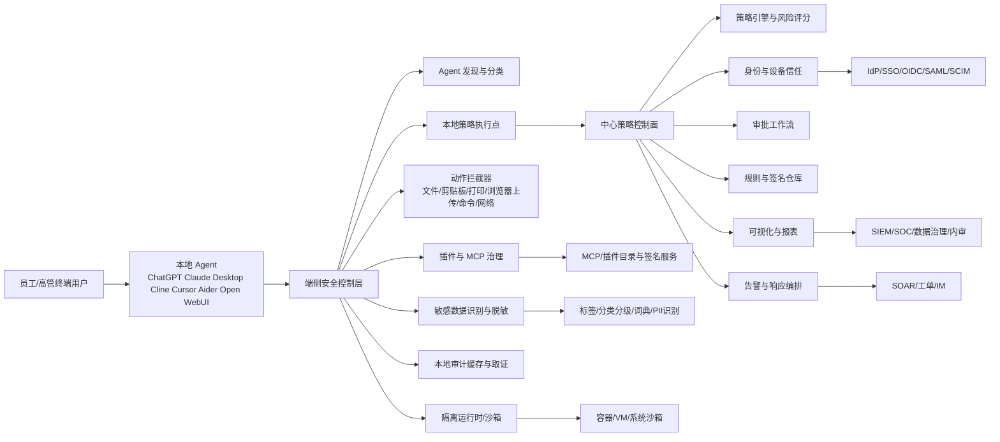

# 构建本地AI Agent安全与隐私防护解决方案分析报告

## 执行摘要

本地 AI Agent 正在从“个人效率工具”快速演进为“可读取终端上下文、连接企业数据、调用本地命令并代表用户执行操作的数字执行体”。从企业普及度看，微软 2024 年工作趋势指数显示，全球 75% 的知识工作者已在工作中使用生成式 AI，78% 的 AI 使用者会把个人 AI 工具带入工作场景；到了 2025 年，82% 的领导者表示将在未来 12–18 个月内把 agent 作为“数字同事”用于扩充团队产能。与此同时，PwC 2026 年 CEO/员工调研显示，企业高层对 AI 的雄心很强，但员工日常稳定使用率仍不高、组织治理与能力建设明显滞后。换言之，企业已经进入“Agent 先落地、治理后补课”的风险窗口期。

对员工尤其是高管终端而言，风险的本质不是“是否装了一个 AI 工具”，而是“是否在不受控前提下，把拥有本地文件、终端输出、浏览器会话、插件扩展、身份凭据、企业 API 与网络访问能力的执行代理交给了模型”。OpenAI、Anthropic、Cline、Claude Code、ChatGPT macOS 等官方文档都已明确，这类 Agent 往往具备读取上下文、访问外部工具、发起网络请求、运行命令、安装或连接扩展/MCP 服务器等能力。如果这些能力没有被最小权限、显式授权、审计留痕和策略阻断所约束，数据泄露、权限滥用、提示注入后越权执行、远程扩展带来的供应链风险、模型与训练数据窃取、侧信道泄露和横向移动都可能从“理论风险”走向“高频运营风险”。

监管与标准层面已经形成清晰共识：一是把 AI 风险管理嵌入现有信息安全、隐私与访问控制体系，而不是把 Agent 当作“普通软件”；二是坚持最小必要、最小权限、显式同意、全程审计、持续监测、供应链验证与安全默认。中国侧需要同时看《个人信息保护法》《数据安全法》《网络安全法》、国家网信办《人工智能生成合成内容标识办法》以及《人工智能安全治理框架》；国际侧则应参考 NIST AI RMF、NIST 零信任、NIST AML 分类、CISA/NSA 安全部署指南、ENISA AI 网络安全实践、ISO/IEC 42001/27001/27701/23894、欧盟 AI Act 与 GDPR。

基于本次调研，适合企业落地的产品定位不是再造一个“大而全”的 AI 平台，而是建设一个“本地 Agent 安全与隐私控制层”：部署在终端与企业控制面之间，统一完成 Agent 发现与分类、权限编排、敏感数据识别、扩展/MCP 治理、命令与网络执行阻断、日志审计、取证追溯与合规报表。短期 MVP 应优先解决四件事：发现终端上有哪些 Agent、识别哪些数据会被它们接触、阻止哪些高风险外发/执行动作、把谁在什么时候批准了什么动作记录清楚。中期再扩展到零信任访问、细粒度最小权限、沙箱隔离、模型与插件供应链验证，以及跨 Windows/macOS/Linux/移动端的一体化策略。该路径既符合现有法规与标准，也与市场上成熟的 DLP、终端安全、MAM/MDM、零信任和 AI Security 产品能力边界相吻合。

## 背景与问题陈述

AI Agent 在企业终端的普及，已经不再局限于单纯问答。官方产品文档显示，ChatGPT macOS 可以通过辅助功能 API 读取兼容应用内容，面向终端场景默认可包含打开窗格中的最后 200 行文本；Claude Desktop 已支持通过“桌面扩展”以接近浏览器扩展的方式安装和管理本地 MCP 服务器；Claude Code、Cline、Cursor、GitHub Copilot CLI 等开发类 Agent 已将“读取/修改本地文件、运行 shell、连接 MCP、管理插件、执行自动化任务”作为核心能力而非附加能力。也就是说，终端上的 Agent 已经具备“感知上下文—调用工具—执行动作—持续记忆/扩展”的完整闭环能力。

“无序增长”的根源主要有三类。第一类是影子 AI：员工直接使用未纳管的消费级 Agent，微软调研显示 78% 的 AI 使用者会自带 AI 工具上班，并且 52% 的人不愿承认自己把 AI 用在最重要任务上。第二类是连接面扩张：MCP、插件市场、桌面扩展和第三方 API 让 Agent 可以快速接入企业知识库、云盘、数据库、浏览器自动化和安全工具，但也显著扩大了信任边界。第三类是能力面上移：2025 年微软报告显示，82% 的领导者预计将在 12–18 个月内把 agents 作为数字团队成员来扩充产能，这意味着越来越多的流程会从“人使用 AI”转变为“AI 在人授权或默认授权下执行”。

在员工与高管终端，风险并不平均分布。高管设备通常聚合董事会材料、并购与财务预测、法务与内控文档、客户与人事信息、战略邮件、即时通信与远程访问权限，因此属于高价值、高暴露、高影响节点。CISA/NSA 等联合指南已明确指出，外部开发 AI 系统在本地或私有云部署时尤其适用于“高威胁、高价值环境”；零信任架构也强调，不能因为设备在内网、属于企业或是高层人员使用，就默认赋予隐式信任。由此推论，高管终端上的本地 Agent 需要比普通办公终端更严格的策略、审批与隔离。

围绕本地 Agent 的风险可归纳为六大类。其一是**数据泄露**：包括读取终端上下文、自动收集文本/代码/终端输出、外发到云模型或第三方服务、日志与取证副本外传。其二是**权限滥用**：即 Agent 或其扩展拥有超过业务需要的工具、目录、脚本、网络或 API 权限。其三是**模型与知识产权窃取**：包括模型权重、微调数据、提示模板、系统指令、策略文件与业务知识库泄漏。其四是**侧信道与隐私泄露**：本地推理并不天然安全，学术研究已经展示本地 LLM 的硬件缓存侧信道可泄露用户输入输出，训练数据提取与模型提取攻击也持续存在。其五是**供应链风险**：插件、MCP 服务器、第三方模型、依赖包、更新链路与桌面扩展目录都可能成为进入点。其六是**横向移动与身份风险**：如果 Agent 能运行命令、访问凭据或调用远程资源，一旦被诱导或失控，就可能成为扩散器。

值得特别强调的是，“本地化”只能降低一部分外发面，并不能自动解决所有安全与隐私问题。Open WebUI 的定位是“可完全离线运行”的自托管 AI 平台，但它同时支持 Ollama 和兼容 OpenAI 的 API；Aider 既可连接本地模型，也可连接云模型；Claude Code 与 Cline 则可以在本地环境中发起命令或连接外部工具。因此，只要存在联网路径、外部扩展路径、日志路径、更新路径或被污染的本地代码路径，本地 Agent 仍然可能成为数据与隐私外泄通道。

## 行业共识与法规要求

### 监管与标准的共同方向

从官方标准与监管文件看，行业共识已相当稳定。NIST AI RMF 将 AI 风险管理定义为贯穿组织治理、风险识别、测量与管理的持续过程；NIST 零信任强调不因设备位置、归属或网络边界而默认信任；NIST 2025 版对抗性机器学习分类则把数据投毒、规避、隐私攻击与滥用攻击纳入统一术语体系。与此同时，CISA/NSA/NCSC 等联合文件强调，AI 安全部署并不是一套与传统安全割裂的新范式，而是在现有安全治理、边界控制、访问控制、供应链验证、日志监控和事件响应之上，补充 AI 特有风险。ENISA 也明确提出，AI 网络安全应同时覆盖 CIA 三元组与更广义的 AI 可信性，并建议在现有 ICT 安全实践之外叠加 AI 特定控制。

MCP 与 Agent 生态的官方文件则把“显式同意、用户控制、数据最小暴露、范围最小化、第三方授权保护”讲得更具体。MCP 规范明确要求：用户必须明确同意并理解所有数据访问与操作、必须保留对共享数据和执行动作的控制；主机在暴露用户数据给服务器之前必须取得明确同意，且未经同意不得将资源数据传输到别处。MCP 安全最佳实践进一步指出，MCP 实现需要重点处理 confused deputy、会话劫持、本地 MCP 服务器被攻陷以及范围最小化等风险。对企业而言，这意味着“允许 Agent 连插件”本身并不合规，只有当插件/服务器的授权边界、访问范围、数据流向和留痕机制被清楚定义后，才能进入生产环境。

### 适用于本地 Agent 的合规要点

下表提炼了与“终端侧本地 Agent 安全与隐私防护”最直接相关的法规与标准要点。表中“落地含义”是结合本课题做出的实施解释。

| 来源 | 核心要求 | 对本地 Agent 落地的含义 |
|---|---|---|
| 《中华人民共和国个人信息保护法》 | 处理个人信息须有明确、合理目的；与目的直接相关；采取影响最小方式；收集应限于最小范围；遵循公开透明并采取必要安全措施。 | 对终端 Agent 的上下文采集、日志留存、剪贴板/文件/IM 外发监测必须做到“最小必要”“可解释”“有策略依据”；默认全量采集不可取。 |
| 《中华人民共和国数据安全法》 | 在中国境内开展数据处理活动及其安全监管，适用本法。 | 企业需要把本地 Agent 涉及的数据分类分级、重要数据识别、跨境与外发控制纳入数据治理，不应把 Agent 看成“纯客户端工具”。 |
| 《中华人民共和国网络安全法》 | 网络安全强调通过必要措施防范攻击、侵入、干扰、破坏和非法使用，并保障网络数据完整性、保密性、可用性。 | 本地 Agent 控制层应覆盖命令执行、网络访问、插件接入、未授权连接和日志审计，而不仅是内容识别。 |
| GB/T 35273-2020 | 中国个人信息保护领域的重要推荐性国家标准。 | 可作为个人信息最小化、告知同意、存储期限与访问控制的企业内部规范基线。 |
| 《人工智能生成合成内容标识办法》 | 对生成合成内容提出显式标识、隐式标识、元数据、用户声明、日志留存等要求，并自 2025 年 9 月 1 日起施行。 | 若本地 Agent 能生成或导出文本、图像、音视频，需要考虑文件级标识、溯源信息和审计留存，尤其是对外传播场景。 |
| 《人工智能安全治理框架》2.0 | 作为全国网安标委技术文件，持续跟踪风险变化、完善风险分类、探索风险分级、动态更新防范治理措施。 | 适合作为企业内部 Agent 风险分类、分级与控制库的中国语境参考。 |
| CNIPA 转引 WIPO《商业秘密与创新指南》 | 商业秘密持有人需要主动管理商业秘密以保持其价值并防止泄露与不当使用，且数字对象同样属于管理范围。 | 本地 Agent 读取的提示词、策略文件、模型参数、代码、数据集、商业计划书等，均应纳入商业秘密防护。 |
| CNIPA《生成式人工智能知识产权导航》 | 企业使用第三方 GenAI 或以自身数据微调时，会面临机密信息、训练数据、输出内容、合同条款等风险；应结合技术、法律和实际保障措施。 | 对本地 Agent 方案而言，隐私控制不能只靠产品设置，还要配套制度、合同和员工培训。 |
| NIST AI RMF 1.0 | AI 风险要以组织治理、概率与影响并重的方式进行持续管理。 | 产品设计应支持风险台账、分级策略、例外审批、持续监测和复盘闭环。 |
| NIST SP 800-207 零信任 | 不因网络位置或资产归属而默认信任，认证与授权在会话前独立完成。 | 对本地 Agent 与其扩展/MCP 服务器应在每次高风险会话前做身份、设备、环境和策略校验。 |
| NIST AI 100-2e2025 | 提供对抗性机器学习术语与分类，涵盖隐私攻击、滥用、投毒、规避等。 | 建议把提示注入、数据投毒、模型提取、隐私攻击纳入统一威胁模型。 |
| CISA/NSA《Deploying AI Systems Securely》 | 适用于高价值、高威胁环境；要求 threat model、严格访问控制、供应链验证、日志监控、回滚、保护模型权重与专有数据。 | 本地 Agent 控制层必须具备策略、回滚、供应链校验、权重/配置访问控制与审计能力。 |
| NSA《AI Data Security》 | 数据安全应覆盖 AI 全生命周期，确保数据未被篡改、无恶意或未授权内容，并保护专有、敏感、关键数据。 | 本地 Agent 的知识库、缓存、日志、向量索引、微调语料都属于数据安全对象。 |
| NCSC《Guidelines for secure AI system development》 | AI 安全必须贯穿设计、开发、部署、运营全生命周期，并确保系统不向未授权方泄露敏感数据。 | 应建立从设计评审到运行监控的全链路安全门禁，而不是在终端侧“打补丁”。 |
| ISO/IEC 42001 | 首个 AI 管理体系标准，关注伦理、透明、持续学习与组织级 AI 管理。 | 适合用作企业级 AI 治理、问责和持续改进框架。 |
| ISO/IEC 27001 | 通过风险管理过程保持信息的机密性、完整性和可用性。 | 适合作为控制层的 ISMS 基座，承接资产、访问、变更、日志与事件管理。 |
| ISO/IEC 27701 | 建立、实施并持续改进 PIMS，可与 ISO/IEC 27001 集成。 | 适合处理 Agent 涉及的个人信息与隐私责任划分。 |
| ISO/IEC 23894 | 为开发、部署和使用 AI 的组织提供 AI 风险管理指南。 | 适合作为 Agent 风险评分、控制优先级和残余风险接受的参考。 |
| 欧盟 AI Act | 旨在促进可信、以人为本的 AI，同时保护健康、安全与基本权利；大部分高风险条款将从 2026/2027 年起适用。 | 欧洲业务需为高风险用例预留数据治理、文档、透明度、人类监督和稳健性能力。 |
| GDPR | 以个人数据保护、合法性、透明度、安全处理、DPIA、跨境传输等为核心。 | 若终端 Agent 处理欧盟居民信息，需为最小化采集、合法依据、删除/导出、处理记录与安全事件响应留出制度和产品接口。 |

综合这些要求，可以把企业在本地 Agent 场景下的合规底线概括为：**先分类，再授权；先最小化，再连接；先留痕，再放权；先验证供应链，再允许扩展；先定义责任，再推广使用。**这一底线与市场上成熟 DLP、零信任、MAM/MDM、AI Security 平台的控制思路是一致的。

## 本地 Agent 分类、风险场景与攻击向量

### 本地 Agent 分类与部署模式

为了治理本地 Agent，首要任务不是“识别产品名”，而是“识别风险形态”。按治理视角，建议从功能、权限、联网、持久性、扩展性五个维度分类。

| 类别 | 典型示例 | 功能特征 | 权限级别 | 联网方式 | 持久性与扩展 | 主要风险映射 |
|---|---|---|---|---|---|---|
| 桌面上下文协作型 | ChatGPT macOS “与应用协作” | 读取编辑器、终端、文本工具上下文；支持选中文本聚焦。 | 中到高：涉及辅助功能 API、应用内容读取。 | 本地 + 可连接云模型。 | 可持续启用；可由企业管理员关闭。 | 上下文过采集、敏感终端输出外发、员工误用消费级账号。 |
| 桌面扩展/MCP 型 | Claude Desktop + Desktop Extensions/本地 MCP | 一键安装并管理本地 MCP 服务器，连接外部工具与数据源。 | 高：可接入本地与外部数据源/工具。 | 本地、局域网、云 API 均可。 | 扩展目录、API key、单击安装。 | 供应链、第三方授权、越权数据访问、凭据泄露。 |
| 终端编码 Agent | Claude Code | 可读文件、改文件、跑 shell、发网络请求；支持细粒度权限模式。 | 高。 | 本地 + 外部 MCP/网络。 | 规则可检入版本控制并组织下发。 | 误执行命令、最小权限失效、仓库秘密与凭据暴露。 |
| IDE/终端代理型 | Cline | 可读写文件、运行命令、使用浏览器；支持 Auto Approve；支持 MCP Marketplace。 | 高。 | 本地 + 浏览器 + 远程 MCP。 | 可自动批准；企业可做 allowlist。 | 自动批准导致高风险命令直通；市场扩展带来供应链风险。 |
| IDE Agent 模式 | Cursor Agent | 面向自动化编码任务、终端命令与代码编辑。 | 高。 | 一般连接云模型，也可与企业环境集成。 | 支持 MCP/Rules/Skills。 | 代码仓权限过大、隐含命令执行、插件/规则失控。 |
| 终端副驾/CLI 型 | GitHub Copilot CLI | 终端原生 Agent；支持 MCP 与插件管理；若无凭据存储，令牌可能落在纯文本配置文件。 | 高。 | 本地终端 + GitHub/外部。 | 插件市场与 MCP 管理。 | 令牌管理不当、插件引入、命令滥用。 |
| 本地离线/自托管型 | Open WebUI + Ollama | 可完全离线运行，自托管，本地模型优先，也支持兼容 OpenAI API。 | 中：默认本地，但取决于是否启用外部模型/API。 | 离线、本地网络、云 API 可混用。 | 可扩展、可作为企业私有入口。 | 本地缓存、知识库、日志、模型更新与被投毒插件。 |
| 代码仓协作型 | Aider | 在本地 git 仓库中编辑文件，支持云与本地模型。 | 中到高。 | 本地/云均可。 | 与 repo 深度耦合。 | 代码、秘钥、提交历史、开发制品泄露。 |

治理上最关键的不是把这些产品“一刀切禁止”，而是区分以下四种部署模式：**纯离线本地**、**本地 UI + 云模型**、**本地 UI + 企业私有模型/知识库**、**本地 Agent + 远程扩展/MCP/插件生态**。前两类主要问题是数据外发与账号治理，第三类主要问题是横向权限与内部数据边界，第四类则是风险最高的一类，因为它同时引入数据访问、代码执行、第三方授权和供应链信任问题。MCP 规范与安全最佳实践都明确提醒，实现方必须处理任意数据访问、代码执行路径与范围最小化。

### 风险场景与攻击向量

下表列出本地 Agent 在终端侧最值得优先治理的场景。表中的优先级是基于“发生概率 × 影响范围 × 隐蔽性 × 可阻断性”做出的研究性判断，属于本报告的分析结论。

| 具体场景 | 形成机制 | 可能影响 | 优先级 |
|---|---|---|---|
| 读取 IDE/终端上下文后外发到云模型 | ChatGPT macOS 可读取终端最后 200 行与编辑器内容；开发类 Agent 默认读取工作区/仓库上下文。 | 源码、密钥、客户数据、财务表、并购材料泄露；高管终端尤其敏感。 | P1 |
| 间接提示注入诱导 Agent 越权调用工具 | OpenAI 指出 Agent 浏览网页、取信息、做代理执行时会暴露新型 prompt injection 面；OWASP 将其归入 Excessive Agency。 | 读取不该读的文件、调用不该调的 API、提交错误命令、删除/修改文档。 | P1 |
| 自动批准或宽松权限模式导致命令误执行 | Cline 支持 Auto Approve；Claude Code 支持 auto / bypass 类模式并要求谨慎使用。 | 文件破坏、恶意脚本执行、后门植入、本地提权、供应链污染。 | P1 |
| 未经审核的 MCP/插件/桌面扩展安装 | Claude Desktop 提供单击安装扩展；Cline 提供 MCP Marketplace，并专门提供 allowlist/禁用能力。 | 第三方服务器拿到过量数据与授权；隐蔽外连；凭据和会话被滥用。 | P1 |
| 日志、审计副本、取证截图外发 | DLP/Agent/平台会保留日志、敏感文件副本或截图；若无加密与边界控制，日志本身成为泄漏面。腾讯 iOA 文档明确提到外发审计会有副本留存和截图取证。 | 二次泄露、审计数据成为新的高敏资产、跨境与合规问题。 | P1 |
| 调用云 API 或 SaaS 知识库时越权访问 | MCP 与第三方 OAuth/API 常引入 confused deputy 风险与静态 client ID 问题。 | 访问非授权知识库、下载机密文档、误用企业应用令牌。 | P1 |
| 模型权重、系统提示、微调数据被窃取 | CISA/NSA 要求限制模型权重访问；研究显示模型提取攻击与训练数据提取攻击持续存在。 | 商业秘密丧失、成本与差异化优势受损、合规与诉讼风险。 | P1 |
| 被污染的本地模型代码或更新链路窃取敏感语料 | 最新研究显示“本地离线微调”并非天然安全，受污染模型代码即可窃取本地细粒度秘密。 | API Key、PII、财务记录、合同条款泄露。 | P1 |
| 利用 Agent 访问凭据后横向移动 | MITRE 将横向移动定义为通过多个系统与账户扩散到目标环境。若 Agent 可以运行命令、读取 token/cookie/SSH key，就可成为跳板。 | 从单机泄露扩展为业务系统、代码仓、知识库、云环境失陷。 | P1 |
| 本地侧信道泄漏输入输出或模型结构 | USENIX/学术研究已展示本地 LLM 的硬件缓存侧信道可泄露 token 值与位置，边缘设备上的侧信道还可用于模型提取。 | 隐私对话、机密提示词、本地模型 IP 被恢复。 | P2 |
| 受信任 Agent 被用于大规模外发或批量操作 | OWASP Excessive Agency 指出，过多功能、过多权限、过高自治会扩大损害范围。 | 误删、误发、误同步、批量泄露。 | P2 |
| 本地缓存、向量索引、会话记忆长期驻留 | 自托管平台和企业 Agent 往往保留本地缓存、知识库和记忆。 | 设备丢失、终端感染后被离线提取。 | P2 |

从攻击路径看，本地 Agent 面临的不是单一点风险，而是多步链路：**外部恶意内容或未审计扩展 → 模型判断被操纵 → 高权限工具被调用 → 数据经过未受控通道离开设备 → 日志或副本进一步扩散**。这与 OpenAI 对 prompt injection 的判断、OWASP 对 excessive agency 的定义、以及 CISA/NSA 对“组合多向量攻击”的提醒高度一致。

## 市场方案与产品对比

当前市场上并不存在一个单一产品能够完全覆盖“发现—分类—最小权限—数据防泄露—扩展治理—审计—零信任—沙箱—行为分析—模型保护”的全部需求。更现实的情况是，企业通常需要把终端安全、DLP、MAM/MDM、零信任、AI 安全网关、浏览器隔离与模型/内容溯源能力组合起来。下面的对比以“是否适合作为本地 Agent 安全控制层的组成部分”为尺度，而不是单纯比拼厂商广度。

| 厂商/方案 | 类别 | 主要覆盖能力 | 部署模式 | 优点 | 局限 | 公开价格 |
|---|---|---|---|---|---|---|
| Microsoft Purview + Endpoint DLP | DLP / 审计 / 内部风险 | 终端 DLP、敏感项识别、活动可见性、内部风险管理。 | 云控制面 + 终端代理 | 与 M365 生态深度集成，适合文档/邮件/OneDrive/终端一体治理。 | 对非微软生态与定制 Agent 行为的“动作级控制”仍需补充。 | Purview 套件约 ¥93/用户/月；M365 E5 约 ¥355–418/用户/月。 |
| Microsoft Intune + APP/MAM + EPM/WDAC | MDM/MAM / 最小权限 / 应用白名单 | 移动应用管理、BYOD 应用级保护、Endpoint Privilege Management、Windows 应用控制。 | 云控制面 + 终端策略 | 适合做“企业数据只在受管应用内流转”“本地提权收口”“脚本与应用白名单”。 | 对 AI 提示注入、插件供应链、模型水印不是主场。 | Intune Plan 2 约 ¥31/用户/月；Intune Suite 约 ¥77/用户/月；EPM 附加约 ¥23/用户/月。 |
| CrowdStrike Falcon Data Security | 终端数据安全 / 云运行时可视性 | 阻断终端风险数据移动、SaaS 访问控制、云运行时可视性。 | SaaS + 单一传感器 | 与终端/身份/云上下文联动强，适合数据窃取与异常外发。 | 价格未公开；更偏平台化交付。 | 未指定/未找到公开价。 |
| Symantec Endpoint DLP | 终端 DLP | 覆盖邮箱、云应用、网络协议、可移动介质、打印、剪贴板等大量通道。 | 云管理 + 终端代理 | 对端点外发通道覆盖广，适合作为“数据最后一公里”控制。 | 更偏传统 DLP；对 Agent 插件/MCP 治理需外接。 | 未指定/未找到公开价。 |
| Netskope One DLP | 统一 DLP / AI 环境 | 单一策略框架覆盖 Web、SaaS、Email、Endpoint、AI 环境。 | 云原生 SSE/SASE | 适合“浏览器—SaaS—AI 应用—端点”跨通道一致策略。 | 终端本地命令与插件治理不是强项。 | 未指定/未找到公开价。 |
| Zscaler AI Security + Cloud Browser | 零信任 / 浏览器隔离 / AI 安全 | AI 红队、风险评估、guardrails、阻止未授权工具、浏览器 DLP、截图/键盘记录器保护、设备姿态检查。 | 云服务 | 对“网页型 Agent 与浏览器上传”治理很强，适合 SaaS/浏览器优先环境。 | 对本地离线 Agent 的文件/命令控制仍需端点产品补足。 | 未指定/未找到公开价。 |
| Cisco AI Defense | AI 安全 / Agent 治理 | 自动发现第三方 AI 应用、策略管理、数据泄露防护、模型验证、运行时防护、对齐 NIST/MITRE/OWASP。 | 多云/企业网络级 | 适合把 AI 应用、模型与 agent 纳入统一安全可视化与红队治理。 | 更偏 AI 安全平台，不替代端点 DLP/MDM。 | 未指定/未找到公开价。 |
| IBM MaaS360 | UEM / MDM/MAM | 统一终端管理、移动安全、应用/邮件容器化、AI 分析。 | SaaS | 适合移动端、BYOD 与企业应用隔离。 | 面向桌面 Agent 的命令级和插件级控制较弱。 | Essentials 起价约 4.24 美元/设备/月。 |
| 腾讯 iOA | 零信任 + 终端安全 + 数据防泄露 | 可信终端、可信身份、可信应用、远程办公、文件外发审计/拦截、零信任访问、威胁检测。 | SaaS / 私有化 | 国内可用性强，终端、访问、数据防泄露一体化，价格公开。 | AI 特定能力如 prompt injection、模型红队与插件签名仍需加强。 | 终端安全专业版约 10 元/终端/月；远程接入专业版约 35 元/账号/月；数据安全模块约 8–15 元/终端/月。 |
| 360 企业安全云 | 终端安全 / DLP / 行为审计 | 统一终端安全与管理、DLP、外设审计、上网行为、软件管控。 | SaaS | 中小企业落地快，终端与数据泄漏治理成本较低。 | 更偏通用终端安全，对 Agent 扩展/MCP 细粒度治理不足。 | 统一终端安全约 80 元/端/年；DLP 约 160 元/端/年。 |
| 奇安信 天擎 + DLP + 零信任 | 终端安全 / DLP / 身份治理 | 一体化终端安全、数据防泄漏、零信任身份与 API 级授权。 | 私有化为主 | 适合政企高合规与复杂内网环境。 | 公开价格未找到；产品组合部署复杂度较高。 | 未指定/未找到。 |
| 深信服 aTrust | 零信任 / 办公空间隔离 | 身份认证、终端检查、动态访问控制、安全工作空间、数据泄密防护、一机多网隔离。 | 私有化/混合 | 适合高敏业务、远程办公、工作空间隔离。 | 对 AI 特有风险检测需要叠加 AI 安全层。 | 未指定/未找到。 |

从市场供给可以看出几个规律。第一，**终端动作控制**最成熟的是传统端点安全、DLP 和应用控制产品；第二，**数据跨通道一致治理**更适合由 SSE/SASE/统一 DLP 平台承担；第三，**AI 特有风险**如 prompt injection、agent 运行时防护、模型红队、AI 资产发现，更接近 Cisco、Zscaler 这类新一代 AI Security 平台；第四，**国内场景**更重视零信任接入、私有化、审计取证和合规集成，以腾讯 iOA、深信服、奇安信、360 为代表。企业若要保护“本地 Agent + 高敏终端”，最佳实践不是二选一，而是以终端安全与 DLP 做底座，以零信任管访问，以 AI Security 管 agent 特有风险。

## 关键需求、产品定位与方案框架

### 企业真实需求与目标用户

结合前述风险与市场能力，企业对本地 Agent 安全控制层的真实需求可以归纳为九项，而且优先级并不相同：

| 需求 | 说明 | 优先级 |
|---|---|---|
| Agent 发现与资产盘点 | 识别终端装了哪些 Agent、扩展、MCP、插件、模型运行时、辅助工具。 | 极高 |
| 敏感数据检测与外发阻断 | 识别文件、文本、代码、终端输出、截图、日志中的敏感内容，并对上传、复制、打印、网盘/IM/浏览器外发做阻断或审批。 | 极高 |
| 最小权限与动作级授权 | 对文件读写、命令执行、浏览器访问、网络请求、API 调用、目录范围、模型权限实行最小授权。 | 极高 |
| 扩展/MCP/插件治理 | allowlist、签名校验、版本锁定、远程服务器禁用、自建目录与统一下发。 | 极高 |
| 审计、取证与可视化 | 谁在何时批准了什么动作、访问了什么数据、经由哪个 Agent/插件发起，需要可回放、可关联。 | 高 |
| 零信任与身份联动 | 将风险设备、异常身份、离岗用户、临时授权与 Agent 能力绑定。 | 高 |
| 隐私最小化与本地优先 | 尽量在端侧完成检测、脱敏、决策与缓存，不把检测面本身变成新的泄密面。 | 高 |
| 可扩展与跨平台 | 覆盖 Windows/macOS/Linux，并预留移动端与 VDI。 | 中高 |
| 合规与第三方评估 | 输出可审计报表，支持内审、法务、客户问卷与第三方测评。 | 中高 |

目标用户不应该泛化为“所有使用 AI 的员工”。更合理的优先画像是三类。第一类是**高权限高价值终端用户**：高管、财务负责人、法务、并购、投关、研发负责人。第二类是**高频 Agent 使用群体**：开发、数据、产品、运营、客服自动化岗位。第三类是**治理与运营角色**：安全、IT、数据治理、合规、内审、法务。前两类是被保护对象，第三类是控制层的操作者和规则所有者。该划分既符合高价值环境优先治理原则，也便于落地最小可行范围。

### 产品定位建议

最适合本课题的产品定位是：**终端侧本地 Agent 安全与隐私控制层**。它不直接替代 LLM、Copilot、IDE Agent 或企业知识库，而是位于它们之上和之间，提供四类统一能力：

首先是**发现与分类**：发现终端上有哪些 Agent、哪个是本地离线、哪个连接云、哪个接了 MCP/插件、哪个能执行命令。其次是**策略与执行**：把“谁、在什么设备、使用哪个 Agent、访问什么数据、能做哪些动作”转化为可执行规则。再次是**审计与响应**：让审批、异常、告警、取证、回滚和联动进入同一控制面。最后是**合规与运营**：把法律、标准、制度要求映射成标签、规则、审批链和报表。这个定位与 NIST AI RMF 的治理思路、NIST 零信任的资源保护思路、CISA/NSA 的安全部署路径和市场上 DLP/终端/AI security 的能力边界相一致。

### 模块化产品架构

这个架构的逻辑来自三个原则。其一，**把策略决策与高风险动作控制尽量前移到端侧**，避免“先泄露、后发现”。其二，**把身份、设备信任与 Agent 能力绑定**，对高风险命令、第三方扩展、云 API、敏感目录访问实施一致的零信任判定。其三，**把日志、审批、例外和取证集中管理**，以满足审计、合规和应急联动需要。这些原则均可从 NIST 零信任、CISA/NSA 安全部署指南、NCSC 指南和 MCP 规范中得到支持。

下表给出各模块的职责、建议技术路线和部署选项。技术选型为本报告建议值，属于研究结论而非唯一实现方式。

| 模块 | 职责 | 关键技术建议 | 交互接口 | 部署选项 |
|---|---|---|---|---|
| Agent 发现与分类 | 识别本机 AI Agent、MCP、扩展、辅助权限、联网方式与风险档案 | 进程/安装包/扩展目录扫描；行为指纹；软件资产清单；签名与哈希比对 | EDR/UEM 接口、安装目录、系统事件 | 本地必选，中心面可汇总 |
| 敏感数据识别与脱敏 | 对文件、终端输出、表单、代码、日志、上传内容做分类分级与局部脱敏 | 规则库 + 词典 + 正则 + 标签 + 本地轻量 ML；优先端侧推理 | 文件系统、浏览器、IM、Agent 输入输出钩子 | 本地优先，必要时混合 |
| 动作拦截器 | 阻断复制、上传、打印、外发、命令执行、网络访问 | DLP 钩子、浏览器扩展、命令代理、网络出口控制、应用控制 | 浏览器、剪贴板、USB、Shell、HTTP/S、网盘/IM | 本地必选 |
| 插件与 MCP 治理 | allowlist、签名校验、版本锁定、审批安装、远程服务器禁用 | 软件供应链签名、MCP 目录镜像、策略化禁用 remote servers | MCP 配置文件、扩展目录、Agent 配置 API | 本地 + 中心控制面 |
| 本地策略执行点 | 在设备上根据身份、环境、风险评分实时做 permit/deny/ask | OPA/Rego 或 Cedar 类策略引擎；缓存策略；离线决策 | 终端代理与中心策略面 | 本地必选 |
| 审计与取证 | 记录谁批准了什么、何时访问或阻断了哪些数据与动作 | 结构化事件、哈希链、防篡改存储、最小化留存 | SIEM/SOAR/审计平台 | 本地缓存 + 中心汇聚 |
| 隔离运行时/沙箱 | 为高风险 Agent、未信任扩展、浏览器任务提供隔离环境 | 容器、轻量 VM、系统沙箱、工作区隔离 | 本地运行时与审批工作流 | 本地/私有化优先 |
| 中心策略控制面 | 统一规则、例外、审批、报表、签名与分发 | 多租户控制台、策略版本管理、审批编排、RBAC/ABAC | OIDC/SAML/SCIM、API、Webhook | 本地/混合/云 |
| 身份与设备信任 | 将用户、设备、会话状态与策略联动 | IdP、MFA、设备姿态、证书、风险分级 | Entra/AD/LDAP/IdP/EDR/UEM | 混合 |
| 告警与响应 | 对高危外发、异常命令、异常扩展安装联动处置 | SOAR、工单、IM、自动隔离、回滚 | SIEM/SOAR/ITSM/IM | 混合 |

从部署形态看，最稳妥的是**“端侧必选 + 中心面可本地/混合部署”**：端侧保证实时阻断与离线可用；中心面负责规则、审批、报表和联动。对高合规行业，建议控制面与日志面优先私有化；对中小企业或跨区域组织，可采用混合模式，即中心控制在私有云/专有区，低敏分析与告警联动接云。CISA/NSA 指南明确指出，AI 安全部署的措施需要根据 on-prem、cloud、hybrid 以及具体威胁画像适配，而不是固定模板。

## MVP 路线图与合规建议

### 最小可行产品与路线图

建议的 MVP 应该围绕“看得见、能阻断、可追责”三件事设计，而不是一开始就追求多模型、多平台、多地域全覆盖。下表给出一个务实的阶段划分。

| 阶段 | 时间估算 | 关键交付物 | 人员与技能 | 主要风险 | 缓解措施 | KPI |
|---|---|---|---|---|---|---|
| 启动与基线梳理 | 3–4 周 | 终端 Agent 资产清单、风险分级、试点部门范围、敏感数据字典、管理制度草案 | 产品经理、安全架构师、终端工程师、法务/合规、数据治理 | 业务范围过大 | 先限定高管与研发试点、人群与终端清单固定 | 发现率 > 90%，高风险 Agent 识别准确率 > 80% |
| MVP 一期 | 8–10 周 | Windows/macOS 端侧 Agent 发现、基础分类、外发通道审计、敏感文件上传/复制阻断、可视化控制台、审批流 | 终端安全、DLP、前后端、日志平台、QA | 误报影响业务 | 先以审计模式运行 2–4 周，再逐步阻断；建立白名单 | 敏感数据违规外发事件下降 50%；误报率 < 10% |
| MVP 二期 | 8–12 周 | 命令执行控制、插件/MCP allowlist、签名仓、例外审批、身份/设备信任联动、审计报表 | 安全架构、终端、后端、身份平台、DevSecOps | 插件生态变化快 | 版本锁定、签名校验、灰度发布、回滚机制 | 未授权 MCP/插件安装拦截率 > 95% |
| 扩展期 | 12–16 周 | 沙箱隔离、浏览器控制、云 API 风险识别、SIEM/SOAR 联动、私有化交付能力 | 平台工程、虚拟化/浏览器、安全运营 | 复杂度上升、跨平台差异 | 拆分成独立模块，优先高风险场景 | 平均响应时间 MTTR 降低 30%，高危事件处置闭环率 > 90% |
| 运营与优化 | 持续 | 基于标准与法规的控制库、模型/插件供应链评估、第三方测评与年度复盘 | 安全运营、内审、合规、红队 | 治理停留在项目制 | 设立长期 owner 与季度评审机制 | 季度策略更新及时率 > 95%，审计通过率持续提升 |

按团队配置，最小可行团队建议为 7–10 人：产品经理 1、终端/内核工程师 2–3、后端 2、前端 1、规则与数据治理 1、安全架构/运营 1、QA 1。若要同时覆盖浏览器隔离、命令代理与私有化交付，建议增加平台/SRE 与 macOS/Windows 专项工程能力。这里的时间与人数属于实施建议，应根据用户终端规模、操作系统分布和是否接入现有 DLP/EDR/UEM 平台调整。该路线与 NCSC 全生命周期方法、CISA/NSA 的“先 threat model、再部署验证、再日志监控与持续更新”逻辑一致。

### 合规、隐私与伦理建议

对于本地 Agent 场景，最常见的失败不是“技术做不到”，而是“为了看清风险而过度采集，反而引入新的隐私与合规问题”。因此建议遵循以下控制原则，并作为产品默认设置而非可选项：

第一，**数据分类分级先行**。所有终端侧控制都应以数据标签为中心，而不是以应用名为中心。至少区分个人信息、商业秘密、源代码、财务与法务材料、客户合同、凭据与密钥、高管材料等类别。只有分级完成，最小必要和最小权限才能落地。

第二，**最小化采集与本地优先处理**。敏感识别、风险评分、命中规则等尽可能在端侧完成；上传到中心面的，应优先上传事件摘要、哈希、标签与裁剪后的证据，而不是原文全文。NIST 与 MCP 规范都强调用户同意、数据最小暴露与风险约束；PIPL 也明确要求目的明确、范围最小。

第三，**加密、密钥管理与防篡改**。本地缓存、日志、副本留存、截屏取证、敏感索引、审批记录都应加密存储；密钥应与设备硬件根或企业密钥系统绑定，中心侧建议接 HSM/KMS，并对证据链做完整性保护。NSA/CISA 指南明确建议使用加密、数字签名、校验和、保险库/HSM 来保护 AI 系统数据与工件。

第四，**访问审计与人类监督**。对高风险动作——例如读取高敏目录、访问第三方知识库、运行 shell、安装扩展、启用自动批准——必须保留显式审批记录、审批理由、操作者、上下文与结果。欧盟 AI Act、NIST AI RMF、OWASP Excessive Agency 以及 MCP 规范都指向同一个结论：对高影响动作必须保留人类监督与责任边界。

第五，**用户告知、同意与透明度**。应让员工明确知道哪些 Agent 被允许、哪些数据会被识别与审计、哪些行为会被阻断、审计数据保留多久、谁可见、如何申诉。若不这样做，产品很容易逼出新的影子 AI。PIPL 强调公开透明；NCSC 与 CISA/NSA 强调 secure by design 中的责任与透明度；CNIPA 转引 WIPO 也建议企业通过制度、培训和技术并行管理商业秘密与 GenAI 风险。

第六，**第三方评估与持续红队**。建议每年至少做一次覆盖本地 Agent、MCP/插件、DLP 规则、供应链更新链路与高价值终端的专项评估；对 prompt injection、越权工具调用、模型/日志外发、侧信道与横向移动做场景化红队测试。Zscaler、Cisco、CISA/NSA 与 OpenAI 的公开材料都说明，Agent 安全是持续对抗，不是一次上线即可收敛的问题。

### 建议优先级清单

如果企业需要一个“从明天开始就能执行”的优先清单，本报告建议按以下顺序推进：

1. **先盘点**：一周内完成高管、研发、财务、法务终端上的 Agent/插件/MCP 资产盘点。  
2. **先收口高风险能力**：立即把“自动批准”“未受控远程 MCP/插件安装”“高敏目录 unrestricted access”列为默认关闭项。  
3. **先做外发阻断**：先拦网盘、IM、浏览器上传、打印、USB 与命令触发的大额/高敏外发，再逐步做细粒度例外。  
4. **先保高价值终端**：高管与关键岗位终端优先上策略，再扩大到全员。  
5. **先定制度**：同步发布本地 Agent 使用规范、审批边界、日志留存说明与责任划分。  
6. **再做平台化**：资产、策略、审批、审计、报表、联动进入统一控制面。  

## 主要参考来源

以下为本报告最主要、最具支撑力的来源，按“官方/权威优先”列示：

中国与中文官方来源包括：  
国家互联网信息办公室《人工智能生成合成内容标识办法》；  
中国网信网《人工智能安全治理框架》2.0 版发布说明；  
中国人大网《中华人民共和国个人信息保护法》与《中华人民共和国数据安全法》检索结果；  
中央网信办《中华人民共和国网络安全法》检索结果；  
国家标准信息公共服务平台 GB/T 35273 条目；  
国家知识产权局《生成式人工智能知识产权导航》；  
国家知识产权局转引 WIPO《商业秘密与创新指南》。  

国际官方与标准来源包括：  
NIST《AI Risk Management Framework 1.0》；  
NIST SP 800-207《Zero Trust Architecture》；  
NIST AI 100-2e2025《Adversarial Machine Learning》；  
CISA/NSA/FBI 等联合《Deploying AI Systems Securely》；  
NSA《AI Data Security》；  
UK NCSC《Guidelines for secure AI system development》；  
ENISA《Cybersecurity of AI and Standardisation》与《AI Good Cybersecurity Practices》；  
ISO/IEC 42001、27001、27701、23894 官方页面；  
欧盟 AI Act 与 GDPR 官方页面。  

Agent 能力与风险相关官方来源包括：  
OpenAI《Designing AI agents to resist prompt injection》与 ChatGPT macOS“与应用协作”帮助文档；  
Anthropic 关于 MCP 与 Claude Desktop 本地 MCP/桌面扩展文档；  
MCP 规范与安全最佳实践；  
Claude Code 权限与 MCP 文档；  
Cline 概览、Auto Approve、MCP Marketplace 文档；  
Open WebUI、Aider、GitHub Copilot CLI、Cursor 官方文档。  

市场方案与产品文档来源包括：  
Microsoft Purview、Intune、Endpoint DLP、Intune APP/WDAC 文档与定价页；  
CrowdStrike Falcon Data Security；  
Symantec Endpoint DLP；  
Netskope One DLP；  
Zscaler AI Security 与 Cloud Browser；  
Cisco AI Defense；  
腾讯 iOA 产品页与计费文档；  
360 企业安全云与 DLP 页面；  
奇安信天擎、DLP、零信任身份产品页；  
深信服 aTrust 零信任方案。  

学术与研究补充来源包括：  
USENIX《Extracting Training Data from Large Language Models》；  
USENIX《I Know What You Said: Hardware Cache Side-Channels in Local LLM Inference》；  
边缘/终端设备模型提取研究与综述；  
本地微调场景秘密窃取研究。